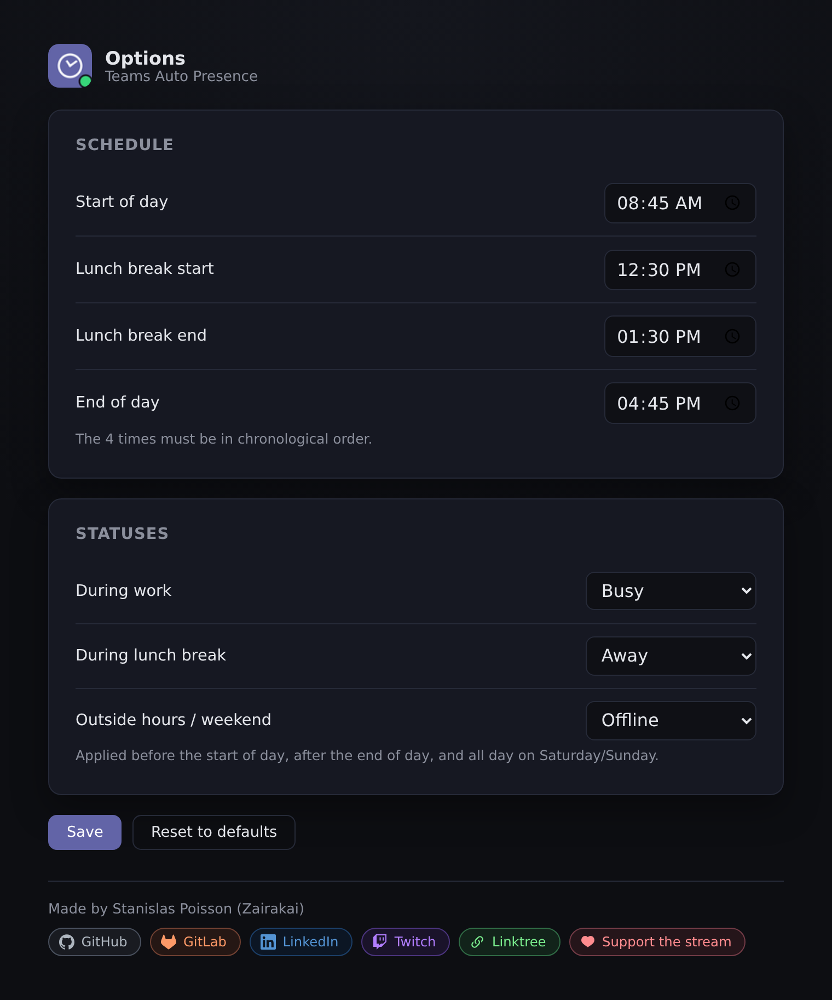
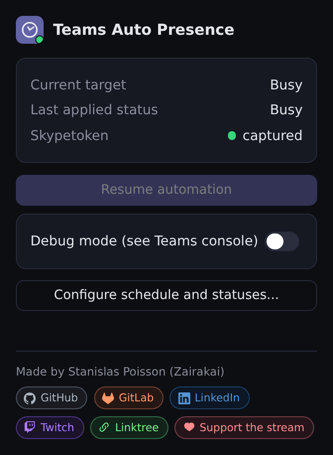
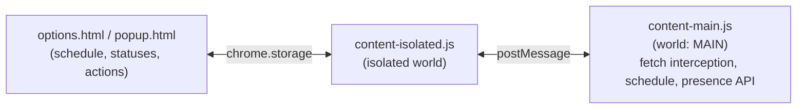

<div align="center">


# Teams Auto Presence

**Automatically switches your Microsoft Teams presence status on a configurable schedule.**

[](LICENSE)
[](manifest.json)

</div>

---

Chrome/Chromium extension (Manifest V3) that automatically switches your
Teams presence status (Available / Busy / Away / Offline / Do not
disturb / Be right back) on a configurable schedule: start of day,
lunch break, end of day, weekend.

> This extension captures a Teams auth token (in memory, never stored or
> sent anywhere other than Microsoft's own presence API) and changes the
> status your colleagues see based on a schedule rather than your actual
> activity. See [PRIVACY.md](PRIVACY.md) for the full detail of what is
> read/stored, and use it in line with your organization's policies.

## Install

<details open>
<summary>From source ("Load unpacked")</summary>

1. Go to `chrome://extensions`.
2. Enable **Developer mode** (top right).
3. Click **Load unpacked** and select this folder.

</details>

<details>
<summary>From a release zip</summary>

```sh
./build.sh
```

Then follow the "Load unpacked" steps above, pointing at the unzipped
folder in `dist/`. `build.sh` makes two zips from the same sources: the
Chromium one (`teams-auto-presence-X.Y.Z.zip`) and the Firefox one
(`teams-auto-presence-X.Y.Z-firefox.zip`, the same files with the add-on id,
the minimum version and the data collection declaration added to the manifest).

</details>

<details>
<summary>Microsoft Edge, Opera, Brave (Chromium)</summary>

They run the Chromium zip as it is: open `edge://extensions`,
`opera://extensions` or `brave://extensions`, enable **Developer mode** and
use **Load unpacked** on the unzipped Chromium zip.

</details>

<details>
<summary>Firefox (version 142 or later)</summary>

1. Open `about:debugging#/runtime/this-firefox`.
2. Click **Load Temporary Add-on** and pick `manifest.json` of the unzipped
   Firefox zip (a temporary add-on is removed when Firefox closes; a listed or
   signed add-on stays).
3. Firefox does not grant the permission to work on Teams at install. Open the
   popup of the extension and click **Allow access to Teams**, then reload your
   Teams tab. (Or in `about:addons` > the extension > **Permissions**.)

The `"world": "MAIN"` content script needs Firefox 128 and the data collection
declaration needs 140 (142 on Android): the Firefox package asks for 142.

</details>

## Configuration

- **Schedule and statuses**: the extension's toolbar icon (puzzle piece)
  -> **Teams Auto Presence** -> right-click -> **Extension options**.
  4 times (start/lunch/end) and the 3 target statuses (during work,
  during lunch, outside hours/weekend).
- **Quick actions**: left-click the extension's toolbar icon (popup):
  - current target, last applied status, skypetoken capture status
  - **Resume automation**: use this if you changed the status by hand in
    Teams (e.g. "Do not disturb" during a meeting) and want to take back
    control right away, without waiting for the next schedule change
    (which resumes it automatically anyway)
  - **Debug mode** (OFF by default): only turn on to diagnose an issue
    (status not following the schedule, skypetoken never captured...).
    Once on, open the browser console (F12) on the Teams tab: every
    intercepted request and API call shows up there with a timestamp.
    Turn back OFF once done.

No file editing required, everything is configured from these two
interfaces.

<details>
<summary>Screenshot - Options</summary>



</details>

<details>
<summary>Screenshot - Popup</summary>



</details>

## Behavior

- Every 60s: unconditionally re-applies the target status (Teams can
  silently override the forced status internally otherwise).
- Every 90s: simulates activity (mousemove) to block the automatic
  switch to "Away" from inactivity.
- Manual status change in Teams (native presence menu): automatically
  paused, as long as the schedule's target doesn't change. Resumes on
  its own at the next schedule change, or immediately via **Resume
  automation** in the popup.
- Weekly: `before start` and `after end` -> "outside hours" status.
  Saturday/Sunday -> "outside hours" status all day.

API strategy: captures the `x-skypetoken` from Teams' own native fetch
requests (passively intercepted), then calls
`PUT /ups/global/v1/me/forceavailability/` directly with that token. No
Azure AD / app registration dependency.

## Architecture

Chrome content scripts run in an isolated JS world by default: they get
their own copy of built-in globals like `fetch`, so overriding
`window.fetch` there never intercepts the page's own fetch calls.

That's solved here by running natively in the page's real context
instead: the script that intercepts fetch (`content-main.js`) is declared with
`"world": "MAIN"` in `manifest.json`, so it runs directly in the page's
real JS context. The tradeoff: a MAIN-world script has no access to
`chrome.*` APIs (no `chrome.storage`). Configuration and popup actions
go through `content-isolated.js` instead (regular isolated world,
`chrome.storage`/`chrome.runtime` access), which relays everything via
namespaced `window.postMessage` (`ns: "teams-auto-presence"`).



## Files

- `manifest.json` - MV3 declaration (content scripts, popup, options, permissions)
- `content-main.js` - core logic (fetch interception, schedule, presence API call)
- `content-isolated.js` - `chrome.storage` <-> `content-main.js` bridge
- `popup.html` / `popup.js` - live status + quick actions (resume, debug)
- `options.html` / `options.js` - schedule/status configuration
- `build.sh` - zip packaging for sideload/CWS

<details>
<summary>Rebuilding the icons</summary>

Icons are generated deterministically with Pillow, no external assets:

```sh
python3 icons/generate.py
```

</details>

<details>
<summary>Rebuilding the store-assets visuals</summary>

Promotional images (Pillow, no external assets):

```sh
python3 store-assets/generate.py
```

Real screenshots of `options.html`/`popup.html` (Playwright, with a
stubbed `chrome.*` API since these pages normally only run inside an
extension context):

```sh
pip install playwright && playwright install chromium
python3 store-assets/screenshots.py
```

</details>

## Privacy

See [PRIVACY.md](PRIVACY.md) for the full detail of what is read,
stored locally, and transmitted (nothing, other than the call to
Microsoft's own presence API).

## Changelog

See [CHANGELOG.md](CHANGELOG.md).

## Statistics

![Statistics of teams-auto-presence][stats-card]

## License

MIT, see [LICENSE](LICENSE).

---

<div align="center">


### Stanislas Poisson - Zairakai

<!-- Drafted by Claude at Stanislas's request - edit freely, it's a guess, not a bio. -->
*Software developer who automates the repetitive parts of work when he
can, and ships the result as a small open-source tool - this extension
being a good example. Also streams on Twitch as **Zairakai**, mixing
code and games with the chat.*

[](https://github.com/Stanislas-Poisson)
[](https://gitlab.com/Stanislas-Poisson)
[](https://www.linkedin.com/in/stanislasp/)
[](https://twitch.tv/zairakai)
[](https://linktr.ee/Zairakai)
[](https://pots.lydia.me/collect/pots?id=18363-dons-stream)

</div>

[stats-card]: https://raw.githubusercontent.com/Stanislas-Poisson/Stanislas-Poisson/main/assets/projects/teams-auto-presence.svg
